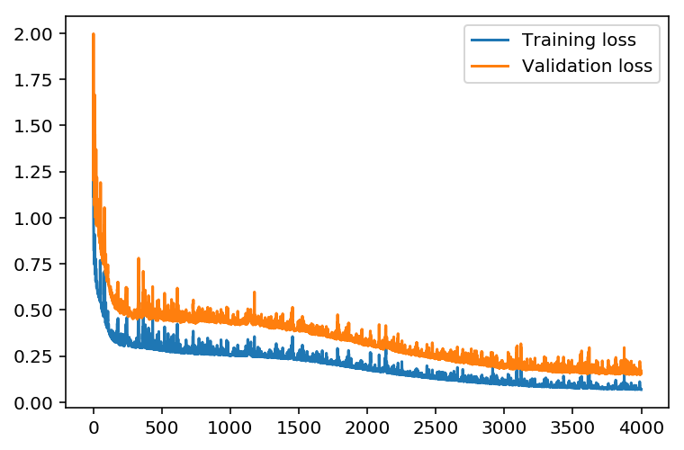
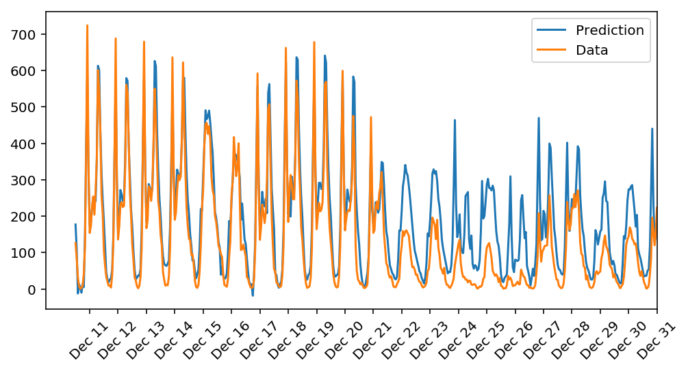

# Predicting Bike-sharing patterns

Built a neural network from scratch without using tensorflow/keras framework to analyse and predict on a dataset from UCI machine learning database.

The Trained network has Training loss: 0.068 & Validation loss: 0.155

The feedforward neural network uses backpropagation algorithm to learn from the data and makes accurate predictions

The goal of the project was predicting daily bike rental ridership using regression

=========================================
### Dataset
=========================================

  [UCI Machine Learning Database](https://archive.ics.uci.edu/ml/datasets/Bike+Sharing+Dataset)
  
  Bike-sharing rental process is highly correlated to the environmental and seasonal settings. For instance, weather conditions,
precipitation, day of week, season, hour of the day, etc. can affect the rental behaviors. The core data set is related to  
the two-year historical log corresponding to years 2011 and 2012 from Capital Bikeshare system, Washington D.C., USA

=========================================
Results
=========================================

######Training loss: 0.068 & Validation loss: 0.155

                                                                     

#####The project meets the specifications, which are:

All the code in the notebook runs in Python 3 without failing, and all unit tests pass.
The sigmoid activation function is implemented correctly.
The forward pass is correctly implemented for the network's training.
The run method correctly produces the desired regression output for the neural network.
The network correctly implements the backward pass for each batch, correctly updating the weight change.
Updates to both the input-to-hidden and hidden-to-output weights are implemented correctly.
The number of epochs is chosen such the network is trained well enough to accurately make predictions but is not overfitting 	to the training data.
The number of hidden units is chosen such that the network is able to accurately predict the number of bike riders, is able 	to generalize, and is not overfitting.
The learning rate is chosen such that the network successfully converges, but is still time efficient.
The number of output nodes is properly selected to solve the desired problem.
The training loss is below 0.09 and the validation loss is below 0.18.

=========================================
Background 
=========================================

Bike sharing systems are new generation of traditional bike rentals where whole process from membership, rental and return 
back has become automatic. Through these systems, user is able to easily rent a bike from a particular position and return 
back at another position. Currently, there are about over 500 bike-sharing programs around the world which is composed of 
over 500 thousands bicycles. Today, there exists great interest in these systems due to their important role in traffic, 
environmental and health issues. 

Apart from interesting real world applications of bike sharing systems, the characteristics of data being generated by
these systems make them attractive for the research. Opposed to other transport services such as bus or subway, the duration
of travel, departure and arrival position is explicitly recorded in these systems. This feature turns bike sharing system into
a virtual sensor network that can be used for sensing mobility in the city. Hence, it is expected that most of important
events in the city could be detected via monitoring these data.

Dataset characteristics
=========================================	
Both hour.csv and day.csv have the following fields, except hr which is not available in day.csv
	
	- instant: record index
	- dteday : date
	- season : season (1:springer, 2:summer, 3:fall, 4:winter)
	- yr : year (0: 2011, 1:2012)
	- mnth : month ( 1 to 12)
	- hr : hour (0 to 23)
	- holiday : weather day is holiday or not (extracted from http://dchr.dc.gov/page/holiday-schedule)
	- weekday : day of the week
	- workingday : if day is neither weekend nor holiday is 1, otherwise is 0.
	+ weathersit : 
		- 1: Clear, Few clouds, Partly cloudy, Partly cloudy
		- 2: Mist + Cloudy, Mist + Broken clouds, Mist + Few clouds, Mist
		- 3: Light Snow, Light Rain + Thunderstorm + Scattered clouds, Light Rain + Scattered clouds
		- 4: Heavy Rain + Ice Pallets + Thunderstorm + Mist, Snow + Fog
	- temp : Normalized temperature in Celsius. The values are divided to 41 (max)
	- atemp: Normalized feeling temperature in Celsius. The values are divided to 50 (max)
	- hum: Normalized humidity. The values are divided to 100 (max)
	- windspeed: Normalized wind speed. The values are divided to 67 (max)
	- casual: count of casual users
	- registered: count of registered users
	- cnt: count of total rental bikes including both casual and registered
	
